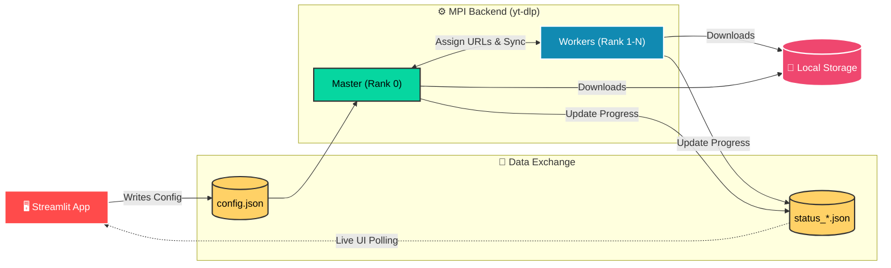

<div align="center">
  <a href="https://github.com/Tanveer457/Yt_Downloder-">
    
  </a>

  <p align="center">
    <strong>A high-performance, parallel video downloading application built with Python, MPI, and yt-dlp.</strong>
    <br />
    It features a modern, real-time glassmorphic Streamlit dashboard for monitoring massive downloading queues.
  </p>

  <p align="center">
    
    
    
    
    
  </p>
</div>

<br/>

## ✨ Key Features

- **⚡ True Parallel Downloading:** Uses `mpi4py` to distribute URLs across multiple CPU cores/processes (Ranks). No GIL bottlenecks—true multi-process parallelism.
- **🏎️ Ultra-Fast Chunks:** Configured to download `10` video chunks concurrently per video, saturating your internet bandwidth to the maximum.
- **🛡️ Anti-Bot Bypass:** Uses advanced `yt-dlp` techniques (Android/Web client spoofing, randomized User-Agents) to prevent "HTTP 403" and "Empty File" errors from strict platforms like YouTube.
- **🎨 Real-Time UI:** A beautiful, dark-mode glassmorphic Streamlit dashboard showing live download progress, ETA, and speeds for every active MPI rank.
- **📊 Smart History & Analytics:** Deduplicated history logging keeps track of your overall success rate and average download speeds across sessions.

---


## 🛠️ Prerequisites

Because this project uses true parallelism, you must have an MPI implementation installed on your system:

### 🪟 Windows
Install Microsoft MPI:
1. Download `msmpisetup.exe` and `msmpisdk.msi` from the [Microsoft MPI release page](https://www.microsoft.com/en-us/download/details.aspx?id=105289).
2. Install both.

### 🐧 Linux / 🍏 macOS
```bash
# Ubuntu/Debian
sudo apt install openmpi-bin libopenmpi-dev

# macOS
brew install openmpi
```

---


## 📦 Installation

This project uses [uv](https://github.com/astral-sh/uv), the incredibly fast Python package manager written in Rust.

**1. Install `uv`** (if you haven't already):
```bash
pip install uv
```

**2. Clone the repository:**
```bash
git clone https://github.com/Tanveer457/Yt_Downloder-.git
cd Yt_Downloder-
```

**3. Install Dependencies:**
Because `uv` is configured for this project, you just need to run:
```bash
uv sync
```
*This will instantly create a virtual environment (`.venv`) and install `streamlit`, `yt-dlp`, `mpi4py`, and `pandas`.*

---


## 🚀 Usage

Do not run the MPI script directly. Instead, launch the Streamlit dashboard, which gracefully manages the MPI processes for you.

```bash
uv run streamlit run app.py
```

### How to use the Dashboard:
1. **Queue Videos:** Paste your video URLs into the text area (one per line).
2. **Configure Workers:** Select how many MPI ranks (parallel workers) you want to use.
3. **Advanced Settings:** Set maximum retries and preferred video quality.
4. **Start:** Click "Start Download". 

The dashboard will launch a background `mpiexec` process and render real-time progress bars by reading status files generated by the workers.

---


## 🏗️ Architecture: The Master-Worker Model

This project features a decoupled architecture where a sleek Streamlit frontend seamlessly manages a high-performance MPI backend.



This project avoids common multi-processing race conditions by using a strict **Master-Worker** pattern via MPI point-to-point communication (`send`/`recv`):

1. **Rank 0 (Master):** Maintains the queue of URLs. It assigns exactly one URL to each available worker.
2. **Ranks 1-N (Workers):** Request work from the Master. When they finish downloading a video, they send a completion signal back to the Master and request the next URL.
3. **Graceful Shutdown:** If there are more workers than videos, the Master safely sends a `-1` termination signal to the idle workers so they shut down cleanly without hanging.

---


## 🐛 Troubleshooting

* **`File locked` or `MediaFileStorageError`:** This usually means a file isn't done downloading but is being accessed. The MPI script uses atomic file renames to prevent Streamlit from reading half-written JSON logs.
* **YouTube "Empty File" or 403 Errors:** If these return, YouTube has updated its bot-detection algorithms. Update `yt-dlp` immediately by running:
  ```bash
  uv add yt-dlp --upgrade
  ```

<div align="center">
  <i>Built with ❤️ using Streamlit, yt-dlp, and mpi4py.</i>
</div>
